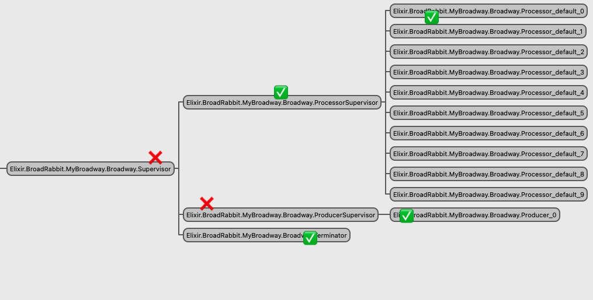

# BroadRabbit

```bash
# bring up rabbitmq
docker-compose up -d rabbitmq
# declare queue
docker-compose exec rabbitmq rabbitmqadmin declare queue name=my_queue durable=true

# pull app deps
mix deps.get

# start app in iex
# for SQS, need to create queue in AWS and export appropriate vars for connecting
export AWS_REGION="$(aws configure get region)"
export AWS_ACCESS_KEY_ID="$(aws configure get aws_access_key_id)"
export AWS_SECRET_ACCESS_KEY="$(aws configure get aws_secret_access_key)"
export SQS_QUEUE="https://us-east-2.queue.amazonaws.com/100000000001/my_queue"
iex -S mix
```

## App Crash

Seems like the wrong supervisor dying will take down the entire app.

I expect them to be restarted.

After trying RabbitMQ and SQS, there seems to be a race condition.
Perhaps restarting too quickly finds the previous processes that have not finished being deregistered (process name).

### RabbitMQ

Check app is running:
```elixir
iex> Application.started_applications() |> Enum.map(&(elem(&1, 0))) |> Enum.find(&(&1 == :broad_rabbit))
:broad_rabbit
```

Kill `ProducerSupervisor`:
```elixir
iex> Process.whereis(BroadRabbit.MyBroadway.Broadway.ProducerSupervisor) |> Process.exit(:kill)
...
14:57:54.967 [info] Application broad_rabbit exited with reason: shutdown
```

App is no longer running:
```elixir
iex> Application.started_applications() |> Enum.map(&(elem(&1, 0))) |> Enum.find(&(&1 == :broad_rabbit))
```


- killing all of the ✅ has its process restarted
- killing the ❌ processes ends up killing the entire application

I expected them to come back up.

It seems like anything involving the `ProducerSupervisor` causes the app to go down.

```
17:08:42.842 [error] Supervisor 'Elixir.BroadRabbit.MyBroadway.Broadway.Supervisor' had child #Ref<0.3383666392.2541486088.26065> started with 'Elixir.Supervisor':start_link([#{id => 'Elixir.BroadRabbit.MyBroadway.Broadway.Producer_0',shutdown => 30000,start => {'Elixir.Broadway.Topology.ProducerStage',...}}], [{name,'Elixir.BroadRabbit.MyBroadway.Broadway.ProducerSupervisor'},{strategy,one_for_one},{max_restarts,...},...]) at <0.331.0> exit with reason killed in context child_terminated
17:08:42.843 [error] Supervisor 'Elixir.BroadRabbit.MyBroadway.Broadway.ProducerSupervisor' had child 'Elixir.BroadRabbit.MyBroadway.Broadway.Producer_0' started with 'Elixir.Broadway.Topology.ProducerStage':start_link([{broadway,[{hibernate_after,15000},{batchers,[]},{context,context_not_set},{resubscribe_interval,...},...]},...], 0, [{name,'Elixir.BroadRabbit.MyBroadway.Broadway.Producer_0'},{hibernate_after,15000}]) at undefined exit with reason {already_started,<0.332.0>} in context start_error
17:08:42.843 [error] Supervisor 'Elixir.BroadRabbit.MyBroadway.Broadway.Supervisor' had child #Ref<0.3383666392.2541486088.26065> started with 'Elixir.Supervisor':start_link([#{id => 'Elixir.BroadRabbit.MyBroadway.Broadway.Producer_0',shutdown => 30000,start => {'Elixir.Broadway.Topology.ProducerStage',...}}], [{name,'Elixir.BroadRabbit.MyBroadway.Broadway.ProducerSupervisor'},{strategy,one_for_one},{max_restarts,...},...]) at undefined exit with reason {shutdown,{failed_to_start_child,'Elixir.BroadRabbit.MyBroadway.Broadway.Producer_0',{already_started,<0.332.0>}}} in context start_error
```

`{already_started,<0.332.0>}`

### SQS


- killing all of the ✅ has its process restarted
- killing the ❌ processes ends up killing the entire application

Kill `ProcessorSupervisor`:
```elixir
iex> Process.whereis(BroadRabbit.MySqs.Broadway.ProcessorSupervisor) |> Process.exit(:kill)
...
14:57:54.967 [info] Application broad_rabbit exited with reason: shutdown
```
NOTE: there were a few times where the processors actually restarted when I manually killed the supervisor using `:observer`.

```
17:06:17.926 [error] Supervisor 'Elixir.BroadRabbit.MySqs.Broadway.Supervisor' had child #Ref<0.1077701136.3078356993.220095> started with 'Elixir.Supervisor':start_link([#{id => 'Elixir.BroadRabbit.MySqs.Broadway.Processor_default_0',shutdown => 30000,start => {'Elixir.Broadway.Topology.ProcessorStage',...}},...], [{name,'Elixir.BroadRabbit.MySqs.Broadway.ProcessorSupervisor'},{strategy,one_for_all},{max_restarts,...}]) at <0.362.0> exit with reason killed in context child_terminated
17:06:17.927 [error] Supervisor 'Elixir.BroadRabbit.MySqs.Broadway.ProcessorSupervisor' had child 'Elixir.BroadRabbit.MySqs.Broadway.Processor_default_0' started with 'Elixir.Broadway.Topology.ProcessorStage':start_link([{name,'Elixir.BroadRabbit.MySqs.Broadway.Processor_default_0'},{partition,0},{type,consumer},{resubscribe,...},...], [{name,'Elixir.BroadRabbit.MySqs.Broadway.Processor_default_0'},{hibernate_after,15000}]) at undefined exit with reason {already_started,<0.363.0>} in context start_error
17:06:17.927 [error] Supervisor 'Elixir.BroadRabbit.MySqs.Broadway.Supervisor' had child #Ref<0.1077701136.3078356993.220095> started with 'Elixir.Supervisor':start_link([#{id => 'Elixir.BroadRabbit.MySqs.Broadway.Processor_default_0',shutdown => 30000,start => {'Elixir.Broadway.Topology.ProcessorStage',...}},...], [{name,'Elixir.BroadRabbit.MySqs.Broadway.ProcessorSupervisor'},{strategy,one_for_all},{max_restarts,...}]) at undefined exit with reason {shutdown,{failed_to_start_child,'Elixir.BroadRabbit.MySqs.Broadway.Processor_default_0',{already_started,<0.363.0>}}} in context start_error
```

Looking deeper there's `{already_started,<0.363.0>}`
